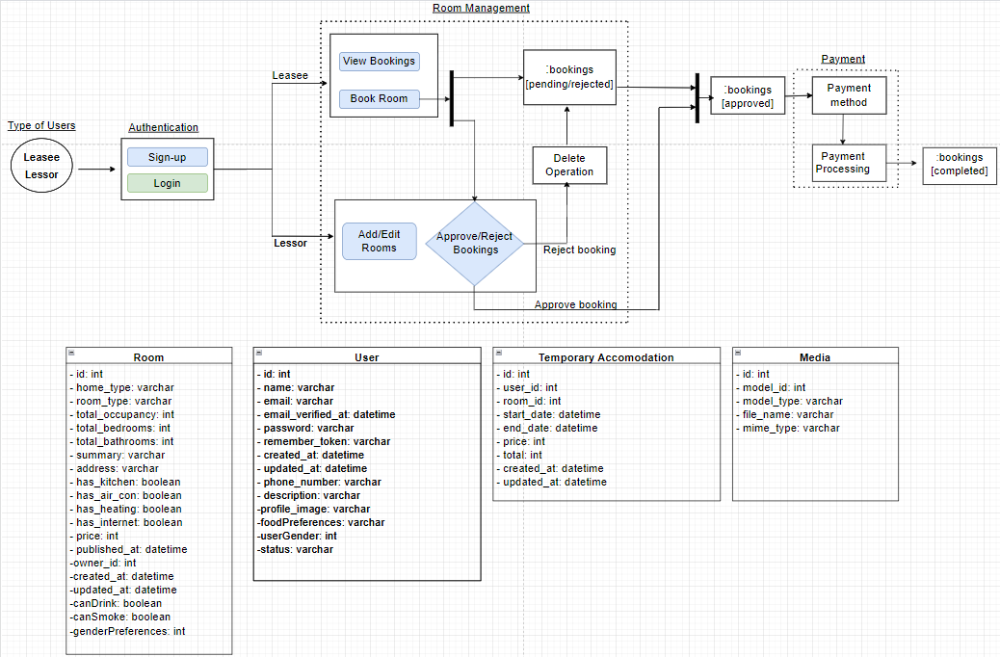
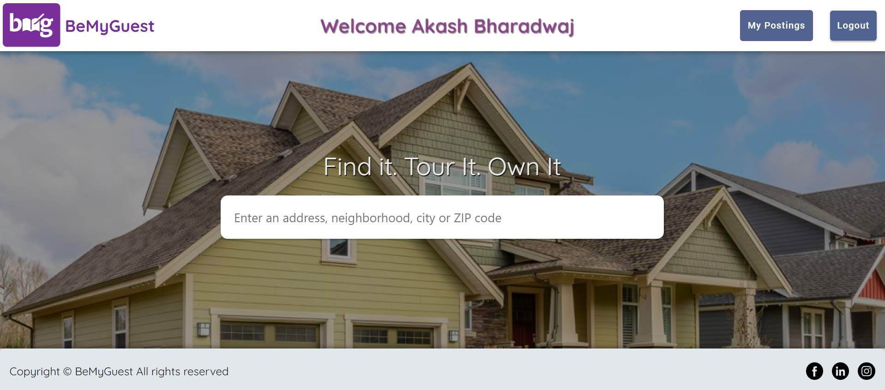
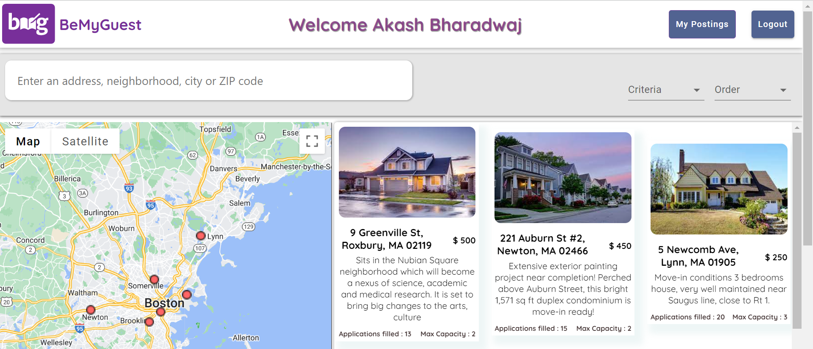
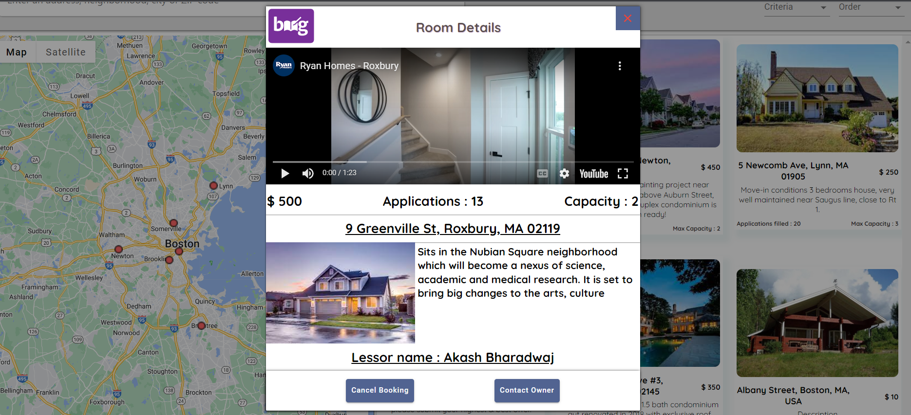

<!-- TABLE OF CONTENTS -->

## Table of Contents

  <ol>
    <li>
      <a href="#about-the-project">About The Project</a>
      <ul>
        <li><a href="#project-title">Project Title</a></li>
        <li><a href="#user-requirements">User Requirements</a></li>
        <li><a href="#sections">Sections</a></li>
        <li><a href="#features">Features</a></li>
        <li><a href="#domain-model">Domain Model</a></li>
        <!-- <li><a href="#built-with">Built With</a></li> -->
      </ul>
    </li>
  </ol>

<!-- ABOUT THE PROJECT -->

## About The Project

Most incoming Northeastern university freshmen tend to face a common problem of having to make expensive interim accomodation arrangements (hotels/AirBnB) between the date of their arrival, and their lease contract's move-in date.

**'BeMyGuest'** is a full-stack application that intends to provide a marketplace for leasing out rooms on a short-term/temporary basis at an affordable price to incoming university freshmen, from willing university connections who have vacancies at their homes.

<h3 id = "project-title" style = "margin-top: 10px; margin-bottom: 10px">Project Title : <em>BeMyGuest</em></h2>

### User Requirements

The high-level user requirements for the project are as follows:

1. Leasee(buyer of rooms) and Lessor(sellor of rooms) must be authenticated/authorized to perform role-related tasks.
2. Leasee must be able to book/view rooms based on preferences
3. Lessor must be able to add/edit rooms, and approve/reject booking requests from leasee
4. Leasee must be able to process payment on approved booking requests and complete booking

<a href="#readme-top">(back to top)</a>

### Sections

The project consists of 3 main sections to achieve user requirements:

- **Authentication** module which consists of the sign-up/login functionalities to authenticate and authorize users of two distinct types - Leasee (buyer of rooms) and Lessor (seller of rooms)
- **Room Management** module which consists of CRUD functionalities being performed on rooms; the leasee can view/book rooms; and the lessor can add/edit rooms and approve/deny booking requests
- **Payment** module which deals with choosing method of payment and processing room payments to complete booking status.

### Features

The Project utilizes the following APIs, frameworks and tools:

- **React**
- **Mongoose**
- **Express**
- **Node**
- **Redux**
- **Material-UI**
- **Google Maps API**
- **GeoLocation API**
- **MailGun Email API**
- **Stripe Payment API**

<a href="#readme-top">(back to top)</a>

### Domain Model

 <h3>Snapshots of Project</h3>

<h3> Snapshots of WebApp </h3>

